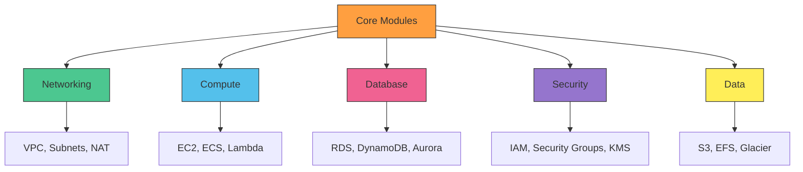

# Tero Architecture Deep Dive

This document outlines the design principles and architecture of the Tero Framework, providing insight into its modular structure and operational philosophy.

## 📐 Design Principles

Tero is built on the following core principles to ensure robust, scalable, and maintainable infrastructure as code:

- **Modularity**: Infrastructure components are encapsulated into reusable, composable modules to minimize duplication and enhance maintainability.
- **Standardization**: Consistent configurations for providers, backends, and naming conventions eliminate drift and ensure predictability.
- **Security First**: Built-in guardrails enforce compliance with standards like SOC2 and CIS benchmarks.
- **Multi-Cloud Abstraction**: A unified interface simplifies workflows across AWS, Azure, and GCP, reducing vendor lock-in.
- **Extensibility**: Semantic versioning and clear upgrade paths ensure Tero evolves with your needs.

## 🏗️ Architecture Overview

Tero organizes infrastructure into modular layers that interact seamlessly. The architecture is visualized below:



### Core Components

1. **Modules**: Reusable building blocks (e.g., VPC, EC2, RDS) with standardized inputs/outputs.
2. **Templates**: Pre-configured project structures for rapid deployment of common architectures.
3. **Testing Framework**: Built-in validation tools to ensure configurations meet best practices.
4. **Backend Configuration**: Standardized S3 or equivalent backend for state management.
5. **Provider Abstraction**: Unified provider configurations for multi-cloud support.

## ⚙️ Module Structure

Each Tero module follows a consistent structure:

- **Source**: Located in `lib/modules/[category]/[module]`.
- **Inputs**: Clearly defined variables (e.g., `name`, `env`, `cidr_block`).
- **Outputs**: Predictable outputs for cross-module referencing (e.g., `vpc_id`, `subnet_ids`).
- **Documentation**: Embedded in `README.md` within each module directory.

Example module structure for `networking/vpc`:
```
lib/modules/networking/vpc/
├── main.tf
├── variables.tf
├── outputs.tf
├── README.md
└── versions.tf
```

## 🔄 Workflow Integration

Tero integrates with CI/CD pipelines and GitOps workflows:
- **State Management**: Terraform state is stored in a secure, versioned backend (e.g., S3).
- **Validation**: Automated checks for drift, compliance, and module compatibility.
- **Deployment**: Modules support `terraform plan` and `apply` with minimal configuration.

## 🌍 Multi-Cloud Support

Tero abstracts provider-specific details into a unified interface:
- **AWS**: Native support for VPC, EC2, RDS, and more.
- **Azure**: Equivalent resources like Virtual Networks and Azure SQL.
- **GCP**: Compute Engine, Cloud SQL, and VPC analogs.
- Providers are configured in `main.tf` with consistent variable names.

## 🔒 Security Integration

Security is embedded at every layer:
- **IAM Roles**: Least-privilege roles generated automatically.
- **Encryption**: KMS integration for data at rest.
- **Compliance**: CIS benchmarks and audit logging enabled by default.
- **Drift Detection**: Automated checks to prevent configuration drift.

## 🚀 Scalability and Extensibility

Tero is designed to scale with your organization:
- **Versioning**: Modules use semantic versioning for safe upgrades.
- **Custom Modules**: Extend Tero by adding organization-specific modules.
- **Community Contributions**: Open contribution model for new features.

For detailed module documentation, see the [Module Reference](module-reference.md).